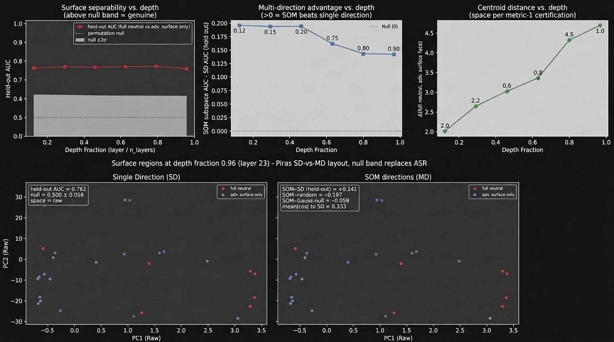
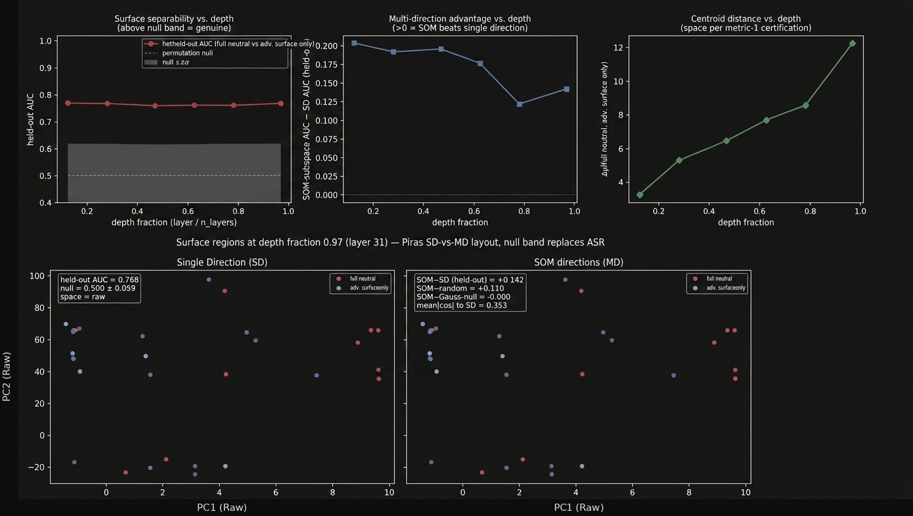

# Construct Validity Before Interpretation

**A proposed identifiability criterion for semantic interpretation of neural probes**

The central contribution is methodological: a probe should not be interpreted semantically unless the intended construct is experimentally identifiable. The maritime intent experiment is the motivating counterexample—a preregistered probe with exemplary held-out performance whose semantic interpretation is blocked because a model-blind statistic reproduces the result.

> **BC1 — Construct-validity criterion**  
> Semantic interpretation requires experimental identifiability. If an observationally equivalent model-blind statistic exists on the observed support, probe validity cannot establish construct validity.

**Research phase:** Phase 1 construct-validity diagnostic. Claims of a validated or deployable monitor remain out of scope.

[](https://osf.io/pnaxk/overview)
[](https://osf.io/xuq5v/overview)
[](https://osf.io/pnaxk/overview)
[](LICENSE)

> **Recreate the initial gate yourself** → [**Kaggle notebook (pinned to repo release `v1.2.1`, ~20 min on a free T4)**](https://www.kaggle.com/code/kjombrellaro/construct-validity-demo-maritime-intent-probe)
> Regenerates the core diagnostic: a preregistered probe saturating (held-out AUC 1.00 at every scan layer) matched on the preregistered multi-turn attack-family subset by a model-blind turn counter (AUC 1.000), computed by `compute_model_blind_witness.py`. Per **BC1** (the identifiability gate), none of it is evidence regarding adversarial intent — that is the point.

---


## Shared evidence platform

The scientific code in this repository is domain-first and self-contained. The
publication contract it emits into is not: it is shared with 3 sibling
repositories and lives in
[`high-trust-evidence`](https://github.com/Cacapice/high-trust-evidence).

```toml
dependencies = ["high-trust-evidence>=1.4,<2"]
```

This repository contributes exactly 1 thing to that contract: an **adapter**,
`from_bc1_report` in `evidence/adapter.py`, which translates a native
`BC1Report` into a `ScientificResult`. The adapter stays here because it encodes
domain knowledge about what the result means, and the platform should never need
to know what a BC1 identifiability gate or a model-blind witness is.

Everything else in the contract, including the qualification algebra, the release
policy, minimization metrics, disclosure accounting and the release signer, is
upstream. `evidence/tests/test_portfolio_conformance.py` fails if any of it is re-vendored here.

**Adapters live in the research repositories, not in the shared platform.** The platform
holds what is common to all 4. Each repository holds what only it knows.


## Contents

- [Reproduce the model-blind witness](#reproduce-the-model-blind-witness)
- [Scientific contract](#scientific-contract)
- [The measurement problem](#the-measurement-problem)
- [The identifiability argument](#the-identifiability-argument-the-mathematical-spine)
- [The Construct-Validity Gate](#the-construct-validity-gate-bc1bc11)
- [The maritime study](#the-maritime-study-a-construct-validity-diagnostic)
- [Rashomon multiplicity and BC1](#rashomon-multiplicity-and-bc1)
- [Research program](#research-program-from-diagnostic-to-validated-framework)
- [Glossary](#glossary)

### Reproduce the model-blind witness

```bash
python compute_model_blind_witness.py --output witness_claim.json
```

This dependency-light path generates repository payload-shape contract, extracts turn counts, and calls `model_blind_witness_test` without a model forward pass. It reports both the perfect result on the preregistered multi-turn families (`fragmentation`, `priming`) and the all-family AUC of 0.750. The latter is a **partial witness**, not a cleared null: adding the single-turn `semantic` and `encoding` families dilutes the turn-count signal, and the resulting 0.250 gap identifies those families as the first targets for a crossed 2×2 redesign.

## Scientific contract

Every published quantity or conclusion in this repository should declare:

1. **Estimand** — what is being measured.
2. **Assumptions** — what the interpretation requires.
3. **Uncertainty** — sampling, seed, fold, or resampling uncertainty where estimable.
4. **Limits** — what the evidence does not establish.
5. **Epistemic status** — `supported`, `blocked`, `unidentified`, or `exploratory`.

The dependency-free [`evidence_platform/epistemic.py`](evidence_platform/epistemic.py) module makes this contract executable. `maritime_counterexample_report().to_dict()` produces the canonical publication summary; `strict_interpret()` refuses to serialize a semantic interpretation unless the required qualification gates have been satisfied. For this repository, **BC1 is the blocking qualification gate**.

### Canonical result summary

```json
{
  "construct_identifiable": false,
  "model_blind_match": true,
  "semantic_interpretation_supported": false,
  "blocking_gate": "BC1",
  "experimental_status": "unidentified"
}
```

### Evidence / interpretation / limit

| Evidence | Interpretation | What cannot be concluded |
|---|---|---|
| Held-out probe AUC reaches 1.00. | The representation predicts the experimental labels. | The direction represents adversarial intent. |
| On the preregistered multi-turn subset, turn count reaches AUC 1.000; across all four families it remains a partial witness at AUC 0.750. | The non-semantic explanation is complete for `fragmentation`/`priming` and remains materially predictive overall; the residual gap is introduced by `semantic`/`encoding`. | Probe accuracy identifies the intended construct, or that the all-family witness has been cleared. |
| Only diagonal `I=L` support is observed. | `Δ(L)` is unidentified in this design. | A larger or nonlinear decoder can recover the missing contrast. |

## Three contributions

1. It argues that semantic interpretations of probes require experimental identifiability in addition to probe validity.
2. It proposes BC1 as one operational diagnostic for assessing that precondition before probing.
3. It demonstrates the resulting failure mode on a preregistered probing study whose held-out performance appears exemplary by conventional standards.

---

## Program origin

This repository documents a change in research direction forced by the experimental evidence, not a plan executed as designed. It started from the probing-as-monitor literature (MacDiarmid et al. 2024; Goldowsky-Dill et al. 2025) and a preregistered confirmatory experiment: train a probe to detect adversarial routing intent in Pythia-1.4B, then test whether that detection transfers across attack classes (OSF pre-registration, xuq5v). The experiment ran as designed, and the result was a probe that saturated — held-out AUC 1.00 — and was stable across seeds and bases. By ordinary probing standards, this should have been a clean confirmatory success.

It wasn't, because a model-blind statistic with no access to the model's internals matched the same AUC. That forced a question the preregistration hadn't asked: not *does the probe work*, but *could anything else have produced this exact result*. Chasing that question down turned into BC1 — the identifiability gate — and BC1 in turn generalized into the ten-control framework (BC1–BC11) below. The confirmatory hypotheses (H1–H5) are still locked and unevaluated on OSF; nothing in the exploratory program that follows retroactively confirms or evaluates them. What changed was the target of the investigation, documented as it happened rather than smoothed over after the fact — OSF Amendment 1 is the formal record of that pivot.

---

## The measurement problem

**Probe validity and construct validity are orthogonal properties.** Existing probe validation practice provides extensive evidence that a decoder exists; it does not, by itself, establish that the decoded variable is the intended construct. A linear probe can predict its label at ceiling and survive every reliability control — permutation nulls, seed stability, held-out generalization, alternate bases — and still measure something other than the phenomenon it is claimed to measure.

- **Probe validity** — can the representation predict the label? (Selectivity, nulls, seed stability, held-out accuracy all speak to this.)
- **Construct validity** — does the label isolate the phenomenon we claim to measure? (Not established by decoder performance alone.)

Their independence is the point: a maximally selective, causally load-bearing direction is still uninterpretable if the design confounds the construct with surface form. The question probe-side controls rarely pose is the one that, we argue, actually decides interpretation —

> **Could another latent variable — one available to the experimenter but not to the model — produce exactly the same observations?**

— because if it could, held-out performance cannot tell the two apart. The operational form of that question is the takeaway of this repository:

> ### If a probe can be matched by a model-blind statistic, held-out probe accuracy alone cannot justify a semantic interpretation.

This has stakes. As agentic security shifts from harmful text to harmful *actions* (OWASP Top 10 for Agentic Applications 2026; joint NSA/CISA/ACSC/NCSC guidance, Apr 2026), activation probes for deception and intent are being proposed as runtime safeguards on the strength of held-out performance (MacDiarmid et al. 2024; Goldowsky-Dill et al. 2025). If such a probe measures surface form rather than intent, held-out performance will not reveal it.

The centerpiece is a **Construct-Validity Gate (BC1–BC11)** — a proposed, reusable workflow that asks the orthogonal question *before* any representation is interpreted. Its first, blocking step — **BC1 — asks whether the target construct is experimentally identifiable before any probe is trained.** BC1 and the boxed check are principle and test: BC1 names the requirement — experimental identifiability — and the model-blind check operationalizes it into a diagnostic that is broadly applicable wherever an appropriate label-preserving model-blind statistic exists. This repository provides a **constructive counterexample**: a probe that satisfies conventional probe-validity criteria while failing the identifiability condition required for semantic interpretation. The gate fires, the block is made legible, and the failure is turned into a specification for designs that would pass.

> **Preview.** The relationship between construct identifiability and predictive multiplicity is developed later in **Rashomon multiplicity and BC1**, where a model-blind witness is interpreted through the Rashomon framework. The central claim is not merely that equally accurate predictors exist, but that predictive equivalence alone cannot identify the semantic construct represented by a successful probe.

---

## The identifiability argument (the mathematical spine)

Define the **hypothesized intent construct** `I` operationally as a latent variable that, if present, can alter downstream policy `D` at fixed surface form `L`. Let `R = h(I, L)` be the residual representation for an unknown `h`. The estimand is whether the representation depends on intent at fixed surface form:

$$\Delta(L) \;=\; h(1, L) - h(0, L).$$

*We operationalize "the construct is represented" as `Δ(L) ≠ 0` for some `L`* — a sufficient, testable handle, not a claim about the *form* of the encoding, so distributed and nonlinear `h` are in scope.

**Why these stimuli cannot answer this.** The current minimal-pair template is reproduced verbatim from [`science/environment.py`](science/environment.py):

```text
template:  "To optimize fuel consumption, the crew has selected the{slot} plan."
clean slot: " standard"      adversarial slot: " alternate"
intent contrast = exactly one word.  No routing decision is ever read out.
```

The swap moves surface form and (nominal) intent *together*, so the dataset contains **only the diagonal support `I = L`** — the off-diagonal cells `(I=0, L=1)` and `(I=1, L=0)` are never observed. On that support a surface-only map `g(L)` reproduces the `R`-distribution of any intent-dependent `h`, so **`Δ(L)` is unidentified**: the failure is **estimator-agnostic** — a bigger probe fits the confound more tightly but cannot break it.

**This is not ordinary confounding.** Ordinary confounding is often removable — by adjustment, controls, or leakage mitigation; here the required support is absent from the design, so no estimator can recover the intended contrast.

**Remedy.** Cross `L` with `D` in a fully-crossed `2×2` (Plain/Adv × Safe/Unsafe): this realizes the off-diagonal cells and makes `h(1, L)`, `h(0, L)` separately observable — the condition the current stimuli never satisfy.

<details>
<summary><b>The same failure in three vocabularies</b> (representation learning · information theory · causal overlap)</summary>

- **Representation learning — non-injectivity.** The map from *which factor `R` encodes* to *the observable `R`-distribution* is non-injective on diagonal support, so no estimator (logistic, MLP, SAE, CCA, kernel) can decide whether the recovered variation is `L` or `I`. This is *consistent with*, not proven by, identifiability results in nonlinear latent-variable models: identifiability can be restored by an auxiliary variable the latents depend on (Khemakhem et al., AISTATS 2020), and unsupervised recovery of latent factors is not guaranteed without added structure (Locatello et al., ICML 2019). Both concern the conditions for recovery; the claim here is that this design does not supply them.
- **Information theory — conditional-MI estimability.** An intent claim needs `I(R; I | L)`, not `I(R; I)`. On the diagonal every `P(I | L=l)` is a point mass, so `I(R; I | L)` is unestimable and the probe reports something monotone in `I(R; L) = I(R; I)`. BC1 operationalizes the requirement that `P(I | L)` have support, without which info-theoretic probing (Pimentel et al. 2020; Voita & Titov 2020) of the intent contrast is not well-posed.
- **Causal design — positivity/overlap.** With `e(l) = P(I=1 | L=l)`, identification of `Δ(L)` needs strict overlap `0 < e(l) < 1` (Rosenbaum & Rubin 1983); here `e(l) ∈ {0,1}` — a total violation. D'Amour et al. (2021) frame strict overlap as a bound on the discriminating information (KL divergence) between the two groups' covariate distributions, and show the implied balance bounds grow more restrictive as dimension increases (converging to zero in some cases) — so **strict overlap is increasingly difficult to satisfy when probing a high-dimensional residual stream** (no do-calculus over hidden units is claimed — the claim is about design).

</details>

---

## The Construct-Validity Gate (BC1–BC11)

A portfolio of ten pre-probing controls spanning the facets of construct validity (Jacobs & Wallach 2021) plus reliability. **BC1 is the blocking, substantive-validity gate**; the rest can only characterize *which* variable drives a separation once one exists — not whether the target construct was identifiable to begin with. Model-scale generalization is a matter of *external* validity and is handled outside the gate (`E7`/`V3`).

This work proposes BC1 as one operationalization of a broader identifiability principle. Whether BC1 itself proves to be the best operational criterion is less important than establishing the broader requirement that semantic interpretations rest on experimentally identifiable constructs.

| Control | Mechanism | Facet |
|---|---|---|
| **BC1** | Adversarial-template null must return AUC ≈ 0.50 or the design is rebuilt | **Substantive — the identifiability gate** |
| BC2 | Normalised vs. unnormalised AUC per encoding variant | Discriminant (surface/tokenisation) |
| BC3 | Final-token vs. mean-pooled collection | Structural (readout ↔ sequential structure) |
| BC4 | Per-class SAE reconstruction MSE | Reliability (instrument fidelity) |
| BC5 | Class-specific vs. global layer selection | Reliability (generalisation-estimate integrity) |
| BC6 | Probe direction stability across seeds | Reliability (estimator stability) |
| BC7 | Within-class variance flag on training classes | Discriminant (variance as rival cause) |
| BC8 | *retired identifier (reserved; no active control)* | — |
| BC9 | Post-patch cosine to legitimate class mean | Convergent (flip ↔ representational move) |
| BC10 | Directional patch applied to legitimate payloads | Discriminant (causal specificity) |
| BC11 | Label-permutation null P95 ≤ 0.55 | Reliability (chance ceiling) |

The four reliability controls (BC4, BC5, BC6, BC11) are precisely what standard probing hygiene already supplies. What the gate proposes to add is the facet that standard hygiene leaves empty: the substantive-validity precondition BC1 would enforce before any of the rest is interpretable. Full table and facet rationale: [`docs/construct_validity_gate.md`](docs/construct_validity_gate.md).

**How BC1 differs from the tools it resembles.** Selectivity/control tasks (Hewitt & Liang 2019) probe *capacity*; amnesic and causal probing (Elazar et al. 2021) test whether a feature is *used*; leakage detection (Boxo et al. 2025) asks whether a predictive signal is *unintended*. Each presupposes that the labels isolate the construct, or looks for a separable leak to remove. BC1 asks the prior question — is the target variable a distinct variable *at all* — which has no separable leak to patch when intended and unintended signals share an axis, as they do here. This is the orthogonality above, made specific: selectivity controls probe *capacity*, identifiability controls *label–design confounding*, and neither substitutes for the other.

---

## The maritime study: a construct-validity diagnostic

Preregistered on Pythia-1.4B & -6.9B Parameters, maritime-logistics minimal pairs. **BC1 did not pass**:  downstream policy is unspecified — the target variable is not identifiable. The confirmatory hypotheses **H1–H5 remain locked and unevaluated on OSF**; the project continues under **[OSF Amendment 1](https://osf.io/pnaxk/overview)** as a bounded exploratory program. None of the data is offered as evidence for adversarial intent.

The diagnostic is legible, and it is where the central takeaway's antecedent is met in a real case: the linear probe saturates on held-out data and is stable across seeds and across raw-residual and SAE bases, yet is matched on the preregistered multi-turn attack-family subset by a model-blind turn counter computed in this repository. A statistic computed without access to the model's internal representations reproduces the probe, so probe success here does not establish semantic representation.





*Depth profile, `neutral_full` vs `adv_surface` (Pythia-1.4B, layer-23 detail).* Held-out AUC (~0.76) sits well above the label-permutation null (0.500 ± 0.058) and is roughly flat with depth; the multi-direction advantage narrows with depth; at 6.9B parameters slight reversion in late layers. Raw centroid distance grows ~2.3× tracking representational norm, at 6.9B parameters there is a steep increase in centroid distance in late layers. <!-- FIGURE QUALIFICATION: Keep this limitation adjacent to the geometric claims and figures. -->
By BC1 these characterize the geometry of construct-invalid stimuli — **not evidence regarding intent**. An NFKC rescue collapses four orthographic families (homoglyph, fullwidth, zero-width, delimiter) to chance; abbreviation is the boundary case (`E5`/`E6`).

**Why this case generalizes.** The maritime stimuli instantiate a construction pattern common throughout mechanistic interpretability: a hypothesized latent distinction is operationalized through a controlled intervention, and examples are generated, edited, selected, or labeled to realize that distinction — the pattern behind many *honest*/*deceptive*, *aligned*/*misaligned*, and *harmful*/*harmless* probing datasets. Such interventions are valuable because they create measurable contrasts. However, they also introduce an identifiability requirement: if the observable consequences of the intervention are perfectly coupled with the intended construct, a representation difference may reflect the intervention, the construct, or both. Without additional identifying assumptions, no probe architecture can resolve this ambiguity from the observed support alone. The relevant question is therefore not only whether a probe separates the classes, but whether the dataset contains the counterfactual variation required to determine what that separation represents.

---

## Connections this framing suggests

Three consequences that follow from the framing above. We offer them as proposals for others to test rather than established results; each stays inside mechanistic interpretability.

### Rashomon multiplicity and BC1

<!-- NOVELTY CALIBRATION: Prefer formulations such as "draws a different consequence" and "treats multiplicity as an experimental diagnostic." Avoid unsupported priority claims such as "first," "novel," or "previously unrecognized." -->

The model-blind turn counter and the saturated linear probe both achieve an AUC of **1.000** on the preregistered multi-turn evaluation subset. In the language of the Rashomon set,

$$
R_{\varepsilon}
=
\left\{
f :
\operatorname{AUC}(f)
\ge
1-\varepsilon
\right\},
$$

both predictors are members of \(R_{0}\) on the observed support. A central observation of the Rashomon literature is that multiple predictors may achieve essentially identical predictive performance while differing substantially in form, complexity, or inductive bias (Breiman, 2001; Marx, Calmon & Ustun, 2020; Semenova, Rudin & Parr, 2022).

BC1 draws a different consequence from that multiplicity. In the preregistered Maritime design, the observed support contains only the **diagonal cells** of the latent construct table: adversarial intent and surface form always co-occur. The counterfactual off-diagonal cells are never observed. Consequently, the empirical distribution cannot distinguish predictors that decode latent intent from predictors that rely exclusively on surface-form correlates. Predictive performance therefore fails to identify the semantic object represented by a successful decoder.

Probe validity asks whether *some* decoder achieves high predictive performance. Construct validity asks whether the intended latent construct is **uniquely licensed** by that performance. When a model-blind statistic occupies the same optimal Rashomon set as a representation probe, semantic interpretation is not identified.

Standard Rashomon analyses typically treat multiplicity as an opportunity for model selection—for example by preferring simpler, fairer, or more stable predictors. **BC1 instead treats multiplicity as an experimental diagnostic.** Membership of both a representation probe and a model-blind statistic in the same optimal Rashomon set indicates that the experimental design has failed to identify the semantic construct under investigation. Under BC1, the appropriate response is therefore not to choose among equally accurate predictors, but to redesign the experiment so that the latent construct becomes identifiable.

> **Proposition (Model-blind witness).**
>
> Let
>
> $$
> f_p \in R_{\varepsilon}
> $$
>
> be a representation probe, and let
>
> $$
> f_b \in R_{\varepsilon}
> $$
>
> be a predictor computable without access to the model representation.
>
> If the experimental design leaves the intended construct unidentified on the observed support, then
>
> $$
> f_p \in R_{\varepsilon}
> \;\wedge\;
> f_b \in R_{\varepsilon}
> $$
>
> does **not** constitute evidence that the probe represents the intended construct.

This proposition formalizes BC1's central claim: **predictive optimality alone cannot establish construct validity when competing explanations remain observationally equivalent.**

### Relationship to BC1

<!-- EDITORIAL INVARIANT: Preserve the distinction below. BC1 does not invalidate probes merely because alternatives exist; the blocking condition is alternative optimal predictors plus an unidentified construct on the observed support. -->

BC1 does **not** reject representation probes because alternative predictors exist. Rather, it identifies the conditions under which predictive performance cannot distinguish among members of the Rashomon set. Under the **Qualification Before Interpretation** framework, membership in \(R_{\varepsilon}\) is evidence of **predictive validity** but not, by itself, evidence of **construct validity**. BC1 therefore functions as a **qualification gate**: semantic interpretation is licensed only after the experimental design renders the intended construct identifiable.

### Phase 1 interpretation

The present **Phase 1** result therefore establishes only that the current experimental design admits indistinguishable model-blind and representation-based predictors on the observed support. It does **not** determine whether latent adversarial intent is represented by the model. Resolving that question requires the crossed intent–surface-form design proposed for **Phase 2**.

### Relationship to the Sovereign Evidence Architecture

Within the broader **Sovereign Evidence Architecture**, BC1 serves as the repository-specific qualification gate governing semantic interpretation. Sovereign publication determines **who may publish**; the qualification algebra determines **what may be claimed**; BC1 determines **when semantic interpretation is licensed**. These layers are complementary: governance controls publication authority, while BC1 controls epistemic authority.

**Activation patching inherits the identifiability burden; it does not discharge it.** Patching (Meng et al. 2022) and causal-scrubbing-style validation (Chan et al. 2022) assume the swapped activation carries the intended semantic content. Under a positivity violation, exchanging activations between the two confounded conditions moves `L` (and whatever `L` is entangled with), not `I` — so a routing flip is not evidence about intent. On this view `E7`'s random-direction and random-layer controls are the *patching analogue* of BC1's null, and we propose treating BC1 (identifiability) as a **precondition** for reading such patching results mechanistically.

**Scale-controlled separation is arguably the more appropriate estimand *given how the model reads the stream.*** LayerNorm substantially reduces the downstream computation's sensitivity to overall residual magnitude (Elhage et al. 2021), so a separation carried mostly by norm may be largely invisible to what the model actually reads. Raw centroid distance `‖μ₁ − μ₀‖` conflates *direction* (feature identity) with *norm growth* — and the observed ~2.3× growth tracks representational norm while normalized separation stays flat. Reporting Fisher ratio / Mahalanobis / cosine (`E3`) is therefore not just statistical hygiene; it aligns the measure with a magnitude-insensitive read, and the norm-vs-direction split it exposes fits naturally with how magnitude and identity come apart under superposition (Elhage et al. 2022).

> **Recommendations (normative — proposed practice, not results of this study).**
> - When a suitable one exists, include a **model-blind readout** — a label-preserving statistic computed without access to the model's internal representations — as a standard member of the probe's comparison set, and treat a match to the probe's AUC as a construct-validity red flag.
> - Treat **BC1 (identifiability) as a precondition** for interpreting activation-patching results, not as something patching establishes.
> - Report **scale-controlled** separation alongside raw geometry whenever a LayerNorm'd stream is being read.
>
> These follow from the arguments above; they are not experimentally validated here and are offered for others to test.

---

## Research program: from diagnostic to validated framework

BC1's role in this project is diagnostic — it identifies that these stimuli cannot support a semantic claim. The next stages are what turn that diagnostic into a validated methodology, and they follow directly from what BC1 exposed rather than being an unrelated list of extensions:

- **V1 — positive control.** If the identifiability framework is right, a construct that *is* experimentally identifiable should pass BC1 and show a geometric profile distinguishable from the current diagnostic. Committed in advance: reproducing the same profile on an identifiable construct counts **against**, not for, the current interpretation — the test is built to be capable of failing.
- **V2 — Orthogonal Intent / Action-Space environment.** The design BC1's failure specifies: a `2×2` fully-crossed `L ⟂ D` environment with action-space (logit) readouts and a stated-vs-true divergence, realizing the off-diagonal cells the current stimuli never populate. This is where the identifiability principle gets tested on genuinely intent-bearing data, including CCS-style probing of behavioral deception (with the known caveat that CCS can latch onto salient-but-arbitrary directions — the same failure mode this project documents; the design, not the probe, is what does the isolating). This crossed design is not merely an extension of the present experiment; it is the minimal experimental intervention required to leave the observational Rashomon set in which latent-intent and surface-form explanations remain empirically indistinguishable.
- **V3 — cross-architecture replication.** Whether the identifiability requirement, and BC1 as its operationalization, hold beyond Pythia and beyond this stimulus family.

Read in sequence, V1–V3 is not a wish list appended to a null result — it is the next phase of a research program whose first phase (this repository) established *why* a construct-validity precondition is needed and produced a reusable test for it. V1–V3 is where that precondition gets stress-tested against designs built to satisfy it.

---

## Custom-pretraining diagnostic (methodological note)

Separate from the Pythia-based construct-validity study above, we also pretrained a set of small transformer variants (dense and MoE, across sizes) as a bounded, non-causal diagnostic — the goal is to characterize *types* of error introduced by architectural choices, to inform the decision to pretrain rather than rely solely on off-the-shelf checkpoints. No claim here concerns adversarial intent or the BC1 result above.

Because the comparison is made *across* architectural variants, loading fidelity into TransformerLens was verified independently for each one — exact logit equivalence, hook-parity between dense and MoE paths, tied-embedding correctness, and RoPE-convention fidelity — via a ported `TransformerBridge` integration and its test suite (`test_maritime_pretrain_bridge.py`, `test_pretrain.py`). This guards against attributing a cross-variant error-type difference to the architecture when it is in fact an artifact of the loading adapter. This diagnostic is exploratory infrastructure, tracked in `CHANGELOG.md`, not `PREREGISTRATION.md`.

---

## Reproduce it

[](https://www.kaggle.com/code/kjombrellaro/construct-validity-demo-maritime-intent-probe)

```bash
pip install -r requirements.txt              # Python ≥ 3.10
VAULT_MODEL_NAME='EleutherAI/pythia-1.4b' python stage_vault.py
python smoke_test.py
```

Stimuli: [`science/environment.py`](science/environment.py) · CVG suite: [`science/bias_controls.py`](science/bias_controls.py), [`science/null_validator.py`](science/null_validator.py) · geometry: [`science/surface_geometry.py`](science/surface_geometry.py) · causal ablation (`E7`, conditional on compute): [`science/patching.py`](science/patching.py). The pinned notebook runs a reduced configuration (six scan layers, 100 payloads/region, masked mean-pooling): point estimates differ from the full pipeline while the qualitative profile reproduces. Synthetic payloads test detectors offline against open-weight models; **no real systems are targeted**, and the construct-validity result is shared *defensively*, so others do not over-trust residual-stream detectors on held-out separation alone.

---

## Glossary

**BC1**  
The blocking experimental-identifiability gate. BC1 asks whether the intended construct is distinguishable from observationally equivalent alternatives on the support induced by the design.

**Probe validity**  
Whether a decoder predicts the experimental labels reliably.

**Construct validity**  
Whether the experimental labels and support isolate the intended latent construct.

**Qualification gate**  
A condition that must be satisfied before a stronger interpretation is licensed.

**Model-blind witness**  
A predictor computable without access to the model representation that occupies the same relevant Rashomon set as the representation probe.

**Observed support**  
The combinations of variables actually realized by the experimental design.

**Partial witness**  
A model-blind predictor that remains materially predictive without fully matching the probe over the full evaluation set. Here the all-family turn-count AUC of 0.750 localizes redesign priority to the `semantic` and `encoding` families.

**Phase 1**  
The present construct-validity diagnostic. It establishes that the current design does not identify latent adversarial intent.

**Phase 2**  
The proposed crossed intent–surface-form design required to realize the off-diagonal cells and test an identifiable construct.

---

## Repository layout

- [`science/`](science/) — research methods, experiments, BC1 diagnostics, geometry, and model-blind witness code.
- [`evidence_platform/`](evidence_platform/) — qualification, controlled-release, vaulting, and reproducibility infrastructure.
- [`docs/`](docs/) — theory, figure governance, and reference documentation.
- Root-level `test_*.py` files — executable scientific and repository contracts.

The research is intentionally primary; platform enforcement supports publication discipline without occupying the scientific namespace.

---

## Documentation & links

- **Figure publication standard** — [`FIGURE_STANDARD.md`](evidence/docs/FIGURE_STANDARD.md) · **repository figure map** — [`FIGURE_MAP.md`](evidence/docs/FIGURE_MAP.md)
- **Full narrative, methods & the identifiability argument** — [`docs/research_narrative.md`](docs/research_narrative.md)
- **Pre-registration & data** — [osf.io/xuq5v](https://osf.io/xuq5v/overview) · DOI [10.17605/OSF.IO/XUQ5V](https://doi.org/10.17605/OSF.IO/XUQ5V)
- **Current analytical plan (Amendment 1)** — [osf.io/pnaxk](https://osf.io/pnaxk/overview)
- **Landscape positioning** — [`docs/theory/POSITIONING.md`](docs/theory/POSITIONING.md)

---

## References

*Probing methodology (probe validity, not identifiability).* Belinkov (2022, *Comput. Ling.*); Elazar et al. (2021, *TACL*); Hewitt & Liang (2019, *EMNLP-IJCNLP*); Pimentel et al. (2020, *ACL*); Ravichander et al. (2021, *EACL*); Voita & Titov (2020, *EMNLP*); Jacobs & Wallach (2021, *FAccT*).

*Mechanistic interpretability & probes-as-monitors.* Elhage et al. (2021, 2022, *Transformer Circuits*); Bricken et al. (2023); Marks & Tegmark (2023, arXiv:2310.06824); Meng et al. (2022, *NeurIPS*); Chan et al. (2022, causal scrubbing); Smith et al. (2025, DeepMind Safety); Goldowsky-Dill et al. (2025); MacDiarmid et al. (2024); Boxo et al. (2025, arXiv:2509.21344); Kulkarni et al. (2026, arXiv:2604.28129).

*Identifiability, multiplicity & overlap (connective framing).* Khemakhem et al. (2020, *AISTATS*); Locatello et al. (2019, *ICML*); Rosenbaum & Rubin (1983, *Biometrika*); D'Amour et al. (2021, *J. Econometrics*); Breiman (2001, *Statist. Sci.*); Marx, Calmon & Ustun (2020, *ICML*); Semenova, Rudin & Parr (2022, *FAccT*).

## Citation

```bibtex
@misc{ombrellaro2026maritime,
  author = {Ombrellaro, Katherine J.},
  title  = {Maritime Intent Probe: Construct Validity Before Interpretation},
  year   = {2026},
  note   = {Pre-registration: https://osf.io/xuq5v, DOI 10.17605/OSF.IO/XUQ5V.
            Confirmatory path blocked at construct validity (BC1); exploratory
            program per OSF Amendment 1 (https://osf.io/pnaxk). H1--H5 locked and
            unevaluated.},
  url    = {https://github.com/Cacapice/Maritime-Intent-Probe}
}
```

AGPL-3.0. Copyright © 2026 Katherine J. Ombrellaro.


---

## Repository metadata

Proposed GitHub description and topics, kept here so the repository page and the
README do not drift apart.

**Description**

> Construct-validity diagnostics for mechanistic interpretability probes: demonstrating why held-out probe accuracy cannot establish semantic representation under confounded stimulus designs. Phase 1 only. Built on the shared high-trust-evidence platform.

**Topics**

`pytorch, open-science, transformer, alignment, representation-learning, pythia, interpretability, reproducibility, research-software, provenance`
