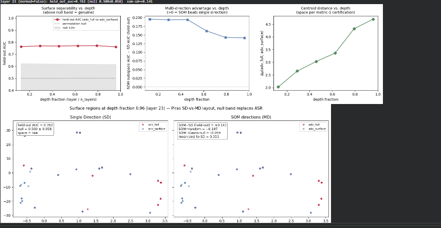

# Maritime Intent Probe

**Mechanistic Interpretability of Adversarial Intent: Construct Validity, Residual Geometry, and Semantic Identifiability**

[](https://osf.io/pnaxk/overview)
[](https://osf.io/xuq5v/overview)
[](https://osf.io/pnaxk/overview)
[](LICENSE)

## Overview

A preregistered mechanistic-interpretability study investigating whether internal transformer representations distinguish adversarial intent from benign inputs (Pythia-1.4B, maritime-logistics minimal pairs).

The principal scientific result is not evidence for or against semantic encoding of adversarial intent. Instead, the study identified a construct-validity limitation: under the original stimulus design, adversarial intent and surface form are perfectly confounded — the defining token swap moves both at once, and downstream policy is never specified — so the target construct is not identifiable from these data by *any* estimator. The preregistered confirmatory hypotheses (**H1–H5**) are therefore unevaluable and remain **locked and unchanged on OSF**. Rather than reinterpret exploratory observations as confirmatory findings, the project proceeds under **[OSF Amendment 1](https://osf.io/pnaxk/overview)**: a finite exploratory program characterizing the representational geometry measured by the existing stimuli, with all semantic conclusions reserved for future identifiable designs.

## Why this matters

Mechanistic interpretability often assumes that successful linear decoding implies recovery of an underlying semantic variable. This study demonstrates a limitation of that assumption: when stimuli do not uniquely identify the intended construct, internal representations can exhibit robust geometric separation while remaining fundamentally ambiguous with respect to semantic interpretation. Decoding performance alone cannot establish that a model represents adversarial intent rather than correlated surface features. Construct validity is a prerequisite for mechanistic interpretation, not a downstream statistical concern.

## Main contributions

- A preregistered construct-validity analysis for mechanistic probing studies
- The Construct-Validity Gate (**BC1–BC11**) for evaluating semantic identifiability before interpretation
- An exploratory characterization of residual-stream geometry induced by a construct-invalid stimulus design
- A bounded exploratory analysis program (**E1–E6**) discriminating among competing geometric and mechanistic explanations
- **Orthogonal Intent / Action-Space Probing**, a proposed framework for restoring construct identifiability
- A reproducible codebase with a documented preregistration and amendment trail

## Construct Validity Gate (BC1–BC11)

The study incorporated an eleven-stage bias-control framework evaluating whether the intended construct remained identifiable throughout the analysis. The first control, **BC1**, established that adversarial intent and surface manipulation were perfectly confounded, that downstream policy was unspecified, and that the semantic variable of interest was therefore not identifiable — preventing meaningful evaluation of the preregistered hypotheses. This was not a statistical failure but a measurement result: the existing stimuli cannot distinguish the intended construct. The remaining controls continue to serve as methodological safeguards for future identifiable datasets.

## What the stimuli actually measure



*Depth profile for the `adv_full` vs `adv_surface` contrast (Pythia-1.4B, layer-23 detail).* **Left:** held-out probe AUC (~0.76) sits well above the label-permutation null band (0.500 ± 0.058) and is roughly flat across depth. **Center:** the multi-direction (SOM) advantage over the single best readout direction *narrows* with depth rather than growing — discriminative information becomes less confined to one learned axis. **Right:** raw centroid distance grows ~2.3x through the residual layers, tracking representational norm. These characterize the geometry induced by the present (construct-invalid) stimuli; by BC1 they are not evidence regarding intent. Scale-controlled versions of the centroid measure are prespecified as **E3**.

## Study progression

**Original confirmatory design.** A preregistered mechanistic probing pipeline asking whether internal representations distinguish adversarial intent from benign inputs, validated through BC1–BC11.

**Construct-validity outcome.** BC1 blocked the confirmatory path: H1–H5 remain unchanged, no confirmatory hypothesis was tested, no confirmatory conclusions are drawn.

**Exploratory program (OSF Amendment 1).** Bounded and non-gating: existing dataset only, no stimulus modification, no analyses added without a further amendment, and no result interpreted as evidence regarding intent. Key observations: held-out probe AUC is ≈0.76 vs a permutation null (≈0.50 ± 0.06), roughly flat across depth; raw centroid separation grows ~2.3× alongside representational norm (native geometry, not normalized separation — scale-controlled measures are prespecified as **E3**); random directions recover an increasing fraction of the contrast with depth, consistently across raw residual and SAE space. These diagnostics are not statistically independent — they interrogate the same representations — but they progressively rule out probe-specific artifacts (dependence on a single learned readout, instability across random baselines, dependence on one representation basis) and collectively shift the burden of explanation toward properties of the representation itself. An NFKC rescue collapses the four orthographic families (homoglyph, fullwidth, zero-width, delimiter) to chance and is silent on the rest, which stay confounded per BC1; abbreviation is the boundary case, prespecified for continuous modeling as **E6**. These observations characterize the geometry induced by the present stimuli only; they do not identify the semantic variable responsible for it.

## Current mechanistic interpretation

Several explanations remain compatible with the observed geometry: activation-scale growth, LayerNorm-mediated attenuation, ambient residual expansion, covariance anisotropy, and distributed versus axis-specific representation. The exploratory program discriminates among them where possible — the LayerNorm reading directly via **E1**, scale versus geometry via **E3**, formal depth modeling via **E4**, ambient baselines via **E2** (conditional on compute), observation-level and null-leakage relationships via **E5–E6** — adopting the least committal interpretation consistent with the evidence. Reporting: effect sizes, 99% confidence intervals, and all prespecified analyses regardless of outcome. Causal analysis of the observed geometry (activation patching) and all cross-scale claims are reserved for the validation program below, per Amendment 1.

## Future validation program

Restoring semantic interpretation requires new identifiable datasets rather than additional analysis of the existing one:

- **V1** — Methodological positive control on a pre-specified identifiable construct. Committed in advance: if it reproduces the BC1 geometric profile, that counts *against* the current exploratory interpretation, not for it.
- **V2** — Orthogonal Intent / Action-Space dataset separating surface manipulation from downstream policy.
- **V3** — Cross-architecture replication beyond the Pythia family.

A subsequent preregistered confirmatory study will evaluate the original semantic question under an experimentally identifiable design.

## Documentation & links

- **Pre-registration & data** — [osf.io/xuq5v](https://osf.io/xuq5v/overview) · DOI [10.17605/OSF.IO/XUQ5V](https://doi.org/10.17605/OSF.IO/XUQ5V)
- **Current analytical plan (Amendment 1)** — [osf.io/pnaxk](https://osf.io/pnaxk/overview)
- **Full narrative, methods & the identifiability argument** — [`FELLOWSHIP_README.md`](FELLOWSHIP_README.md)

## Quickstart

```bash
pip install -r requirements.txt   # Python ≥ 3.10
VAULT_MODEL_NAME='EleutherAI/pythia-1.4b' python stage_vault.py
python smoke_test.py
```

Stimuli: [`environment.py`](environment.py) · CVG suite: [`bias_controls.py`](bias_controls.py), [`null_validator.py`](null_validator.py) · geometry: [`surface_geometry.py`](surface_geometry.py) · ablation (validation program): [`patching.py`](patching.py). Synthetic payloads test detectors offline against open-weight models; no real systems are targeted.

## Reproducibility

- Original preregistration preserved unchanged; OSF Amendment 1 documents the exploratory program
- All prespecified analyses reported regardless of outcome
- Analysis code version controlled; complete computational workflow released with the repository

## Citation

```bibtex
@misc{ombrellaro2026maritime,
  author = {Ombrellaro, Katherine J.},
  title  = {Maritime Intent Probe: A Pre-Registered Study of Linear Adversarial-Intent Representations in Language-Model Residual Streams},
  year   = {2026},
  note   = {Pre-registration: https://osf.io/xuq5v, DOI 10.17605/OSF.IO/XUQ5V. Confirmatory path blocked at construct validity (BC1); exploratory program per OSF Amendment 1 (https://osf.io/pnaxk). H1--H5 locked and unevaluated.},
  url    = {https://github.com/Cacapice/Maritime-Intent-Probe}
}
```

AGPL 3. Copyright © 2026 Katherine J. Ombrellaro.
